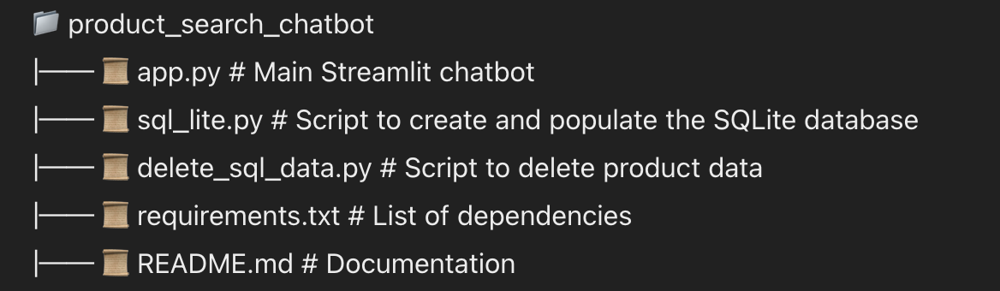

# 🛒 Product Search Chatbot  

This project is a **Streamlit-based Product Search Assistant** that leverages **LangChain**, **FAISS**, and **OpenAI/Groq embeddings** to perform natural language product searches from an SQLite database.  

## 🚀 Features  
- **Natural Language Search:** Find products using text queries.  
- **Embeddings with FAISS:** Uses OpenAI/Groq embeddings to search product descriptions efficiently.  
- **Memory-Powered Conversations:** Maintains chat history using LangChain memory.  
- **Customizable LLM Integration:** Supports OpenAI and Groq models.  

---

## 📌 Prerequisites  
Before running the chatbot, ensure you have:  
- Python 3.8+ installed  
- Required dependencies (install using the steps below)  
- A valid **OpenAI API Key** and/or **Groq API Key**  

---

## 📂 Project Structure  

